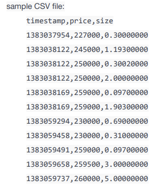

# 비트코인 거래 내역 변환 마이그레이션 프로그램
#### for Candlestick chart

## 목표 :

- 주어진 CSV 는 (쉼표로 구분된 값)는 과거의 비트코인 거래이다.
- 수많은 데이터를 CandlestickChart 에 사용할 수 있는 값으로 빠르게 변환하는 마이그레이션 작업
- csv 파일의 값을 임의의 기간(30초 ~ 1일)별로 나눠 JSON ARRAY 형식으로 표출한다.

### 거래 내역 변환 목표 프로세스 
1. 옛 거래 데이터를 신규 포맷에 변경 맞춰 요청
2. Chart Server 가 API 를 통해 CSV 파일 요청
3. 전달 받은 CSV 파일을 가공/ JSON ARRAY 형태로 데이터 표출

